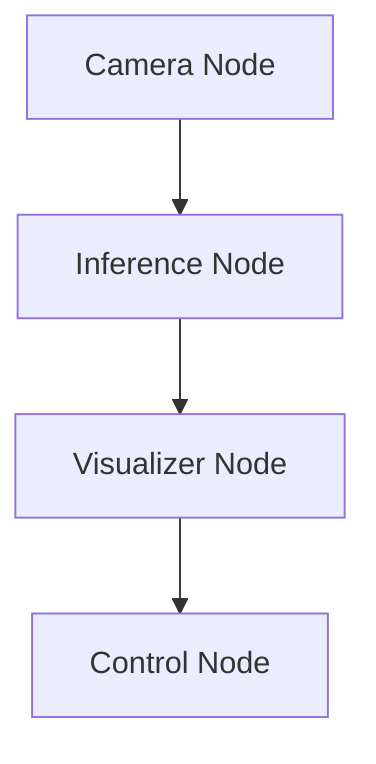

# 🤖 Vision-Based Control Framework for a Mobile Robot
*(Work in Progress)*

## 📝 Overview

This repository contains a control framework for a vision-guided mobile robot.  
At the current stage, the project focuses on designing, implementing, and evaluating a modular control system that enables a wheeled robot to reliably track the object, successfully coping with external disturbances.

The system combines perception outputs with classical control strategies. While the current implementation relies on deterministic control logic, the framework is designed to support future extensions toward learning-based methods.

---
## 🎯 Aim of the Project
The primary aim of this project is to develop a **reliable and interpretable control architecture** for a mobile robot operation whose main goal is to track the object and collect it using robotic arm based on visual feedback.

The project specifically aims to:
- Bridge perception and control
- Develop real-time operation with minimal latency
- Make mobile robot and robotic arm work as a single body
- Provide a baseline system suitable for further research and learning-based extensions such imitation learning

---

## 🏁 Project Goals

The main goals of the project are:
- Design a modular control system for a wheeled mobile robot and robotic arm
- Use vision-based measurements (distance and lateral offset) as control inputs
- Implement closed-loop control using classical control methods
- Handle perception uncertainty and extenral disturbances
- Ensure real-time feasibility and debuggability
- Establish a foundation for future imitation or policy learning

---

## 🏗️ General System Architecture

* Camera Node - Initializes hardware interfaces to capture and synchronize RGB and Depth image streams. It serves as the primary data source for the perception pipeline
* Inference Node - receives the RGB and depth frames from Camera Node and runs inference on RGB frame.
* Visualizer Node - Responsible for data processing and the user interface. It extracts the Region of Interest (RoI) from depth maps to calculate spatial coordinates. To ensure data reliability, it uses dual Kalman filters for distance approximation and implements a gating mechanism to filter out disparity spikes
* Control Node - Acts as the system's decision-maker. It processes lateral and forward distance errors through PI controllers to generate movement commands. The node manages the robot's behavior through a quasi-state machine (including Search, Approach, and Centering modes) to ensure precise navigation and task execution.
